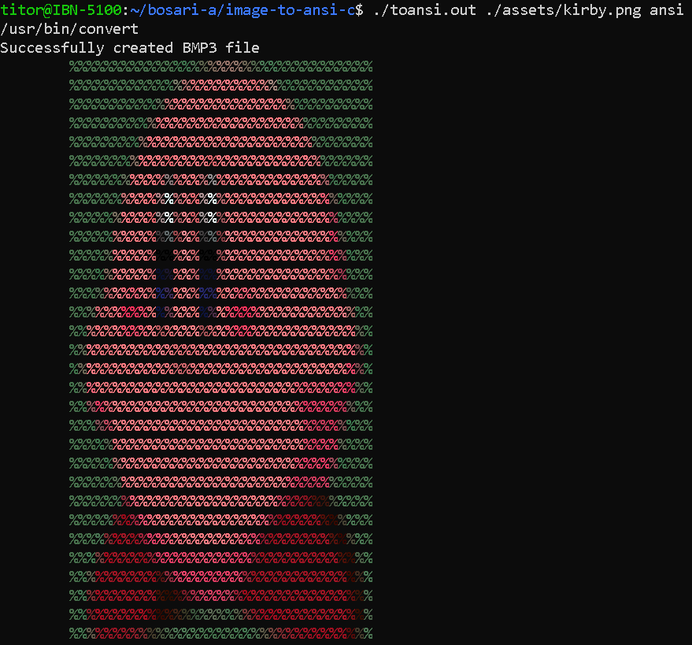

# Images to ANSI (and HTML)

## Description

This project is a command-line tool that allows you to create ANSI art from images.

## Features

- Simple command with two arguments.
- Outputs both ANSI and HTML art.

## Installation

- Step 1 - Download or copypaste the `process_img` bash script file.
- ⭕Important⭕ Run `$ sudo mv process_img /usr/local/bin/` in order to make the command available globally to your shell.
- Step 2 - Compile the C code in `toansi.c` or download the executable binary.
- (Optional) you can also `$ sudo mv toansi /usr/local/bin/`
if you want to use the command globally.

## Usage

The command is quite simple:

```bash
$ toansi {path/to/image} option
$ toansi ./img.png ansi # example
$ Available options: [ansi] [html]
```

You may also find it useful to redirect the HTML output into an html file. For example: `$ toansi some_img.jpeg html > index.html`

## Example results

<div style="display:flex;gap:10px;padding:5px">


</div>


<div style="display:flex;gap:10px;padding:5px">


</div>


<div style="display:flex;gap:10px;padding:5px">


</div>

## Process explanation

The C executable uses the `system` function from `stdlib.h` to call the `process_img` bash script. The `process_img` script looks at the image path argument and converts the image to a 24 bit RGB truecolor BMP Windows 3.x 35 pixel wide bitmap file.

The executable then continues if the temporary BMP file is successfully created. It parses the BMP file and creates the ANSI or HTML art from it.

The temporary BMP file is removed after execution.

No libraries were used to parse the BMP file. All the parsing code and code in `bmp.h` are written by me with the help of researching the BMP 3.x spec and analyzing the CS50x filter-more problem set `bmp.h` file.

## Challenges

- When using `fread` at some point I encountered strange "memory bugs". I discovered later with `printf(sizeof(SOME_STRUCT))` that C structs are padded in memory. So I had to use `__attribute__((__packed__))` in order to disable the padding behaviour.

- According to the BMP spec, BMP files may have padding in their rows:
    > Each scan line is zero padded to the nearest 4-byte boundary. If the image has a width that is not divisible by four, say, 21 bytes, there would be 3 bytes of padding at the end of every scan line.

    The challenge for me was to `fseek` through the padding since I am using `fread` one `ROW` at a time. This was made a bit more difficult due to the fact that the padding was variable.

    I tried writting various padding values by hand and I got something like this:

    | width (pixels) | padding (bytes) |
    | -------------- | --------------- |
    | 2              | 2               |
    | 3              | 3               |
    | 4              | 0               |
    | 5              | 1               |
    | 6              | 2               |
    | 7              | 3               |
    | 8              | 0               |
    | 9              | 1               |
    | .              | .               |
    | .              | .               |
    | .              | .               |
    | `w`            | `w % 4`         |


    I noticed that the padding was just `width (pixels) % 4`. I do not have a proof that this pattern will continue, I am sure the proof is simple but for some reason I can't see it. I spent quite a while on this even though I spotted the pattern quickly.

- I would also like to make the installation section easier in the future by adding a setup script that installs everything from github.
